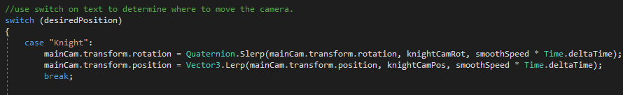
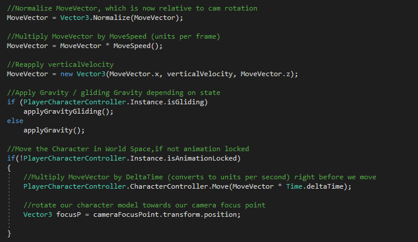
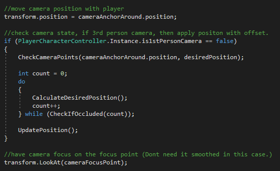
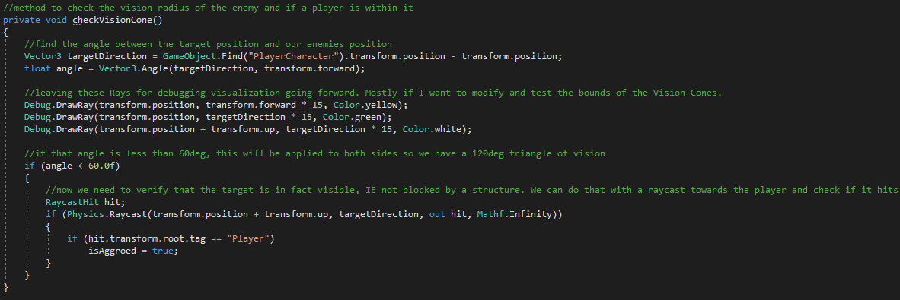
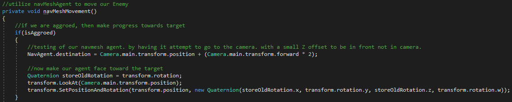

# Midnight-The-Final-Sun
Version/Build: 0.72

This project is intended to explore the Unity Engine and Programming within it. I am utilizing Assets and animations that I have unpacked from Fallout 4 and Dark Souls Prepare to Die edition. Midnight, The Final Sun is purely for educational purposes.

**Many features are still being implemented. More work done everyday! See roadmap at the bottom of this Readme**

## Installation

* Download/clone the latest build in the Builds folder, run the **Midnight, The Final Sun.exe** executable on Windows machines.
* Currently only supporting Windows, due to active development. Will support Windows, Mac, and Linux systems in future.

## Game Clips / Source Code Details

### MAIN MENU
+ Upon startup you will be greeted by the Main Menu, from there you can Select one of 4 options:
+ If new game is chosen, you will be given a list of classes to pick and be asked to enter a character name.

### PLAYER MOTOR
+ Motion is tracked as a movement vector and appended to by the inputs of the Horizontal / Vertical Axis, X/Y. This motion is supported with KBAM and Controller inputs.

### CAMERA OCCLUSION
+ Camera Occlusion is checked when in Third Person mode. If there are objects other than the Player or Enemy Units, the occlusion system checks if it can make a moderate jump and not be occluded. If this check does not pass after maxOcclusion checks then it goes in quickly as the camera is very occluded. Once the camera is no longer occluded it returns to previous positioning

### ENEMY AI
+ Inherits from the Unit class like the Player and all other units
+ Enemy AI is built with the Unity NavMesh system and NavMeshAgents, for now I have built a simple 'ZOMBIE' style ai that has an aggro radius and field of view. Once within the FOV (Angle between forward vector and vector to Player), the enemy will lock onto the player and start chasing to attack. Enemies can be killed (Health reaches 0) and once killed their Rigidbody will activate so their bones can ragdoll.

## Roadmap

+ Finish gameplay aspects. Weapons / Weapon types changes
+ Allow Class changes: Dark Knight, Dragon Knight, Ninja, etc.
+ Append AI to include a Knight class enemy, and a Boss.
+ Re-implement previous menu interface.
+ Finalize a small populated zone for small sessions.

## License
MIT License

Copyright (c) [2019] [Kristopher Moore]

Permission is hereby granted, free of charge, to any person obtaining a copy
of this software and associated documentation files (the "Software"), to deal
in the Software without restriction, including without limitation the rights
to use, copy, modify, merge, publish, distribute, sublicense, and/or sell
copies of the Software, and to permit persons to whom the Software is
furnished to do so, subject to the following conditions:

The above copyright notice and this permission notice shall be included in all
copies or substantial portions of the Software.

THE SOFTWARE IS PROVIDED "AS IS", WITHOUT WARRANTY OF ANY KIND, EXPRESS OR
IMPLIED, INCLUDING BUT NOT LIMITED TO THE WARRANTIES OF MERCHANTABILITY,
FITNESS FOR A PARTICULAR PURPOSE AND NONINFRINGEMENT. IN NO EVENT SHALL THE
AUTHORS OR COPYRIGHT HOLDERS BE LIABLE FOR ANY CLAIM, DAMAGES OR OTHER
LIABILITY, WHETHER IN AN ACTION OF CONTRACT, TORT OR OTHERWISE, ARISING FROM,
OUT OF OR IN CONNECTION WITH THE SOFTWARE OR THE USE OR OTHER DEALINGS IN THE
SOFTWARE.
